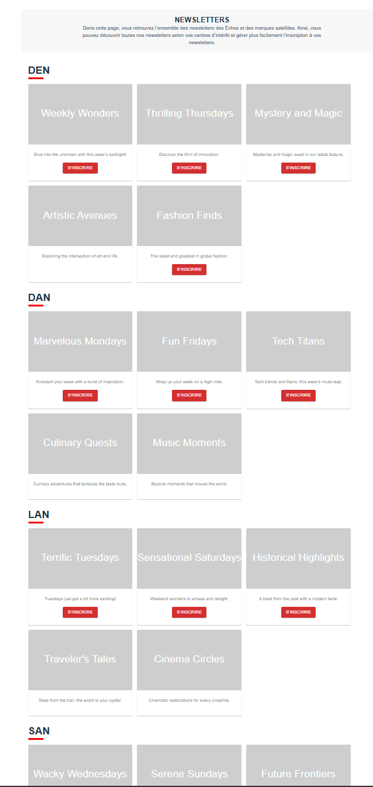

# **ECHOS**

## 🔍️ Context

Technical test developed in ReactJS + Material UI (with viteJS)

## 🚀 Quickstart

## Backend 

cd backend
run `npm install` to install all required dependencies
run `npm start` to start the nodejs server listening on port 3000


## Frontend

Run `npm install` to install all required dependencies
Run `npm run dev` to start the application (the application will be available at http://localhost:5173/)

to update subscription level of the user, in the file src/contexts.ts, import the wanted value and change the default value of AuthContext

for example, if you want a user without subscription :

```
import { USER_WITHOUT_SUBSCRIPTION } from './mocks/user'
export const AuthContext = createContext(USER_WITHOUT_SUBSCRIPTION) // USER_WITHOUT_SUBSCRIPTION, USER_WITH_ONE_SUBSCRIPTION, USER_WITH_MULTIPLE_SUBSCRIPTION
```

Run `npm run test` to launch unit tests of the application

### Result screenshot



